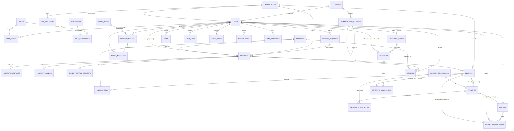

# Nawill App — Architecture & Database Schema

**Document version:** 1.0 · **Date:** 18 July 2026
**Author:** Ushahemba Shir
**Status:** Draft for review

Companion docs: [PRD](./PRD.md) · [Technical Docs & Flow Diagrams](./TECHNICAL.md)

---

## 1. Tech Stack

| Layer | Choice | Rationale |
|---|---|---|
| **Backend** | NestJS 10 (Node 20 LTS, TypeScript) — modular monolith | Stated; team expertise; module system maps 1:1 to the domain modules; SOLID, clear separation of concerns |
| **Frontend** | Next.js 14+ (App Router, TypeScript) + Tailwind CSS | Stated (Next.js); SSR for public pages (blog/FAQ SEO), SPA feel for dashboard. Tailwind wasn't specified in the original brief — added as the pragmatic default for a scaffold (zero design-system decisions needed to get a working shell up). **This build is structure only** — see [§8](#8-frontend-architecture) |
| **ORM** | Prisma (recommended) | Type-safe client, migrations, excellent DX in a TS monorepo; soft delete via client extension (`deletedAt` filter applied globally). Alternative: TypeORM if you prefer decorator entities/AR pattern — but Prisma's migration story and type safety win for a fresh codebase |
| **Database** | PostgreSQL 16 | Stated |
| **Cache / Queue** | Redis 7 + BullMQ | Cache, sessions, rate limits, background jobs (webhooks, emails, requery). **In this build**, Redis is wired up and live for one thing only — auth security (§7.7): login lockout counters, password-reset tokens, 2FA challenges/setup secrets. General response caching, session storage, and BullMQ job queues are still deferred (see [QA.md §7](./QA.md#7-known-gaps-explicitly-out-of-scope-for-this-pass)) |
| **Monorepo** | Turborepo + pnpm workspaces | Lighter than Nx, first-class Next.js support, shared packages with remote caching |
| **Auth** | JWT (access 15 m) + refresh (7 d); argon2id hashing; Redis-backed login lockout + password reset + 2FA (§7.7) | **This build:** refresh tokens are stateless (re-verified and re-signed, not stored/rotated in Redis) — see [QA.md §7](./QA.md#7-known-gaps-explicitly-out-of-scope-for-this-pass) |
| **Validation** | `class-validator` / `class-transformer` (global `ValidationPipe`, whitelist) | |
| **API Docs** | `@nestjs/swagger`, OpenAPI at `/api/docs` (open in dev/test, Basic-Auth gated in prod) | The `@nestjs/swagger` **CLI plugin** (`nest-cli.json`) generates most request/response schema from TS types + `class-validator` decorators automatically — controllers only add `@ApiTags`/`@ApiBearerAuth`, DTOs need no manual `@ApiProperty` boilerplate. Response *envelope* shape (`{success,message,data,meta}`) isn't individually schema'd per route (would mean `@ApiResponse` on ~40 handlers) — a documented DRY tradeoff, see [QA.md §7](./QA.md#7-known-gaps-explicitly-out-of-scope-for-this-pass) |
| **Logging** | Pino (`nestjs-pino`) | |
| **Health** | `@nestjs/terminus` | |
| **Errors** | Sentry | Not wired up in this build — unhandled exceptions are still logged via Pino, just not shipped anywhere |
| **Email** | Gmail SMTP via `nodemailer` (`MailService`) | **This build:** real delivery when `GMAIL_USER`/`GMAIL_APP_PASSWORD` are set; falls back to the in-memory `DevMailboxService` with zero code changes otherwise (§7.7) |
| **Files** | S3-compatible object storage; `sharp` for images | Not built in this pass — KYC documents are metadata-only records (§7.3 note) |
| **Testing** | Jest (unit) + Supertest (e2e) against a real local Postgres + Redis (created/flushed per run) | See [QA.md](./QA.md) for the full disposable-DB/Redis strategy — Testcontainers noted there as the eventual CI-portable option |
| **Deployment** | Docker (multi-stage `apps/api/Dockerfile`) + `docker-compose.yml` (api + postgres + redis) at the repo root, modeled on the working pattern in the `spending-advisor` project | `docker compose up` gives a self-contained stack (migrate → seed → serve, see the Dockerfile `CMD`); local dev still runs against directly-installed Postgres/Redis, not compose — see [§9](#9-environment-setup-dev--prod) |
| **CI/CD** | GitHub Actions → build, test, migrate, deploy to SoftKloud (dev on merge to `develop`, prod on release tag) | Not set up in this build — the Dockerfile is deploy-target-agnostic (SoftKloud, Render, Fly, etc. can all run the same image) |
| **UI hosting** | Vercel (initial) | Stated |

---

## 2. Monorepo Layout

```
nawill-app/
├── apps/
│   ├── api/                 # NestJS
│   │   ├── Dockerfile       # multi-stage: deps -> build -> runtime
│   │   └── .dockerignore
│   └── web/                 # Next.js — client dashboard scaffold (§8); no /admin surface built
├── packages/                # not created yet — nothing to share between one API and one
│                             # structural-scaffold web app; see §8 for what "later" looks like
├── docs/
│   ├── PRD.md
│   ├── ARCHITECTURE.md
│   ├── TECHNICAL.md
│   ├── QA.md
│   └── postman/
├── docker-compose.yml        # api + postgres + redis, for deployment/full-stack spin-up
├── .dockerignore
├── Makefile                  # make dev-api / dev-web / test / migrate / seed / docker-up / ...
├── turbo.json
├── pnpm-workspace.yaml
└── .github/workflows/       # ci.yml, deploy-dev.yml, deploy-prod.yml
```

## 3. Module Boundaries (Modular Monolith)

Each NestJS module owns its tables, exposes a public service interface, and never reaches into another module's repository directly — cross-module calls go through the exporting module's service (or emit domain events). This is what makes later extraction to microservices cheap.

```
apps/api/src/modules/
  ├── auth/               # signup, login, JWT, refresh, password reset, 2FA
  ├── users/              # profiles, KYC, organizations
  ├── rbac/               # roles, permissions, guards, decorators
  ├── countries/          # countries + administrative-division hierarchy (§7.9)
  ├── projects/           # projects, changes, status requests
  ├── invoices/           # invoices + items, numbering, PDF generation, pay-with-wallet
  ├── payments/           # initiate, webhooks, reconciliation, requery, processors
  ├── wallets/            # wallet balance, ledger, funding (via payments), wallet debits
  ├── bank-accounts/      # payout-eligible bank accounts, Paystack-verified (§7.8)
  ├── external-services/  # every outbound third-party call lives here (§7.8)
  ├── analytics/          # customer-facing overview aggregation (+ admin analytics reads)
  ├── support/            # tickets, messages, ticket types
  ├── notifications/      # MailService (Gmail SMTP) + DevMailboxService fallback; SMS/WhatsApp adapter later
  ├── redis/              # RedisService (ioredis), global module
  ├── prisma/             # PrismaService, global module
  └── health/             # terminus health indicators
common/                   # interceptors, filters, guards, decorators, pagination, DRY access-control util
```

No `admin/`, `services/` (catalogue endpoints), `files/`, `blog/`, or `reviews/` module exists yet — the service catalogue is seeded data queried directly where needed (invoices, projects) rather than its own CRUD module, and the rest are Phase 2 per [PRD §4.2](./PRD.md#42-phase-2). `referrals/` similarly has no module — the schema in §7.6 is migrated, but referrals are Phase 3 with no service or route in this build.

## 4. Engineering Conventions

- SOLID + dependency injection everywhere; controllers thin, services own logic, repositories own data.
- Soft delete globally (Prisma extension) — hard deletes only via admin data-retention jobs.
- All money in minor units (`BIGINT`) — no floats, ever.
- Conventional commits; PR reviews; `develop` → dev env, tags → prod.
- **Casing:** camelCase for fields/variables/functions, PascalCase for classes/types — never snake_case in application code. The one deliberate exception is existing Prisma **enum values** (`pre_project`, `wallet_funding`, `in_progress`, …) — left as-is on request, to avoid a migration plus edits across ~20 files and every doc for a cosmetic rename of already-shipped, tested enums. New enum-like fields (e.g. `AdministrativeDivision.type`, service pillar/billing seed keys) use camelCase/PascalCase values from the start. DB-level identifiers (table names via `@@map`, column names) stay `snake_case`/lowercase per normal Postgres convention — that's a SQL-layer convention, not "code."
- **DRY, deliberately enforced, not just aspirational:** `UpdateProjectDto extends PartialType(CreateProjectDto)` rather than hand-duplicating optional fields (`@nestjs/mapped-types`); `assertOrgAccess()`/`assertSelfOrStaff()` in `common/auth/access.util.ts` replace what were four near-identical private methods across services; `@IdempotencyKey()` param decorator replaces a `requireIdempotencyKey()` helper that was copy-pasted into two controllers; `SAFE_USER_SELECT` lives in one file (`modules/users/user.select.ts`) instead of two; `paginatedFrom()` collapses the "unpack `{items,nextCursor}`, rebuild the envelope" boilerplate that was repeated in every list endpoint.
- Seeds are idempotent by construction — every seed function upserts by a natural unique key (country `iso2`, service `name`, role `name`, division `(countryId, parentId, name)`, admin `email`, …), so `prisma db seed` can run on every deploy, not just once. See [§7.9](#79-country--administrative-division-hierarchy) for the country/division loader specifically, and [QA.md §3](./QA.md#3-disposable-database--test-and-erase) for how tests verify this.

## 5. Capacity Estimation

### 5.1 Assumptions

| Parameter | Value | Basis |
|---|---|---|
| Daily Active Users (DAU) | < 100 now; plan for 1,000 (10× headroom) | Stated requirement |
| Requests per active user/day | ~50 (dashboard loads, project views, invoice checks) | Typical B2B dashboard usage |
| Read : Write ratio | ~80 : 20 | Dashboard-heavy workload |
| Avg API payload (response) | ~5 KB (JSON) | Paginated lists of 20 items |
| Avg uploaded file | Avatar ~200 KB, KYC doc ~2 MB, ticket attachment ~1 MB | Post-compression |

### 5.2 Traffic

```
Current:  100 DAU × 50 req/day = 5,000 req/day
          ≈ 0.06 RPS average
          Peak (assume 10× avg, business hours): ~0.6–1 RPS

10× growth (1,000 DAU): 50,000 req/day ≈ 0.6 RPS avg, ~6–10 RPS peak
```

**Conclusion:** even at 10× growth, a single modest app instance (1–2 vCPU, 2–4 GB RAM) handles this comfortably. The bottleneck will never be raw traffic at this stage — it will be third-party payment latency and operational reliability.

### 5.3 Bandwidth / Storage

```
API traffic:   ~750 MB/month (current) → ~7.5 GB/month (10×)
File traffic:  ~600 MB/month uploads + ~1.2 GB/month downloads
Total network: < 3 GB/month now, < 15 GB/month at 10×

Relational data: well under 1 GB/year including indexes and audit logs
Files:           ~0.5 GB avatars/KYC year one; ticket attachments ≈ 1 GB/year
                 → plan 5–10 GB object storage year one, grows linearly
Redis:           256 MB is generous (sessions + cache + rate-limit counters)
```

Any VPS/cloud plan covers this; no CDN required for the API. Static frontend served from Vercel's CDN (already included).

## 6. Scalability & Extensibility Path

| Stage | Trigger | Change |
|---|---|---|
| Now (≤1k DAU) | — | 1 app instance + worker, 1 Postgres, 1 Redis |
| Stage 2 | CPU > 70% sustained | Run 2+ stateless API instances behind Nginx LB (nothing in code changes — sessions are in Redis) |
| Stage 3 | Heavy reads | Postgres read replica; route analytics queries to it |
| Stage 4 | A module dominates load | Extract that module (e.g. payments) to its own service — boundaries already clean |

---

## 7. Database Schema

### 7.1 Global Column Contract

Every table includes:

| Column | Type | Default | Notes |
|---|---|---|---|
| `id` | UUID (v7 recommended) | generated | Primary key |
| `status` | BOOLEAN | `true` | Active flag (domain-specific status columns are separate enums) |
| `createdAt` | TIMESTAMPTZ | `now()` | |
| `updatedAt` | TIMESTAMPTZ | auto-updated | |
| `deletedAt` | TIMESTAMPTZ | `NULL` | Soft delete — all queries filter `deletedAt IS NULL` by default |

> Because `status` is a boolean on every table, lifecycle states (e.g. invoice paid/pending) use their own explicitly named enum columns (`invoiceStatus`, `paymentStatus`, `ticketStatus`) to avoid collision.

### 7.2 Entity Relationship Diagram



### 7.3 Table Definitions

*(Common columns from §7.1 omitted for brevity — they exist on every table.)*

**users**

| Column | Type | Notes |
|---|---|---|
| `name` | VARCHAR(120) | required |
| `email` | CITEXT UNIQUE | required, verified flag below |
| `passwordHash` | VARCHAR | argon2id |
| `emailVerifiedAt` | TIMESTAMPTZ NULL | |
| `userType` | ENUM(client,staff,admin) | default `client` |
| `clientType` | ENUM(individual,corporate) NULL | mirrors website inquiry form; null for staff/admin |
| `organizationId` | UUID FK → organizations NULL | null for staff/admin. **Implementation note:** individual clients also get an `Organization` row at signup (`sector="individual"`) rather than staying null as originally specified — `projects`/`invoices` require a non-null `organizationId`, and giving every client a consistent owner avoids a nullable-FK special case throughout those modules. The user-facing distinction between individual/corporate is still `clientType`, not the presence of an organization. |
| `countryId` | UUID FK → countries NULL | nullable — `GET /countries` (§7.9) exists for a picker, but signup doesn't require selecting one yet; set later via profile update |
| `phoneNo` | VARCHAR(20) | E.164 |
| `avatarFileId` | UUID FK → files NULL | |
| `lastLoginAt` | TIMESTAMPTZ NULL | |
| `twoFactorMethod` | ENUM(none,email,totp) | default `none`; durable setting, changed via the account-security endpoints |
| `twoFactorSecret` | VARCHAR NULL | TOTP secret only — set when `twoFactorMethod=totp`, null otherwise. Login-lockout counters, password-reset tokens, and 2FA login challenges are **not** columns here — they're Redis-only (§7.7) |

**organizations**

| Column | Type | Notes |
|---|---|---|
| `name` | VARCHAR(160) | |
| `sector` | VARCHAR(80) | |
| `rcNumber` | VARCHAR(40) UNIQUE NULL | CAC RC number |
| `headOffice` | TEXT | address |
| `sizeRange` | ENUM(1-10,11-50,51-200,200+) | |
| `kycStatus` | ENUM(pending,submitted,approved,rejected) | default `pending` |

**kyc_documents**
`organizationId` FK | `docType` ENUM(cac_certificate,utility_bill,id_card,other) | `fileId` FK → files | `reviewStatus` ENUM(pending,approved,rejected) | `reviewedBy` FK → users NULL | `reviewNote` TEXT NULL

**countries** (seeded — 250 countries/territories, see §7.9)

| Column | Type | Notes |
|---|---|---|
| `name` | VARCHAR | common name, e.g. "Nigeria" |
| `officialName` | VARCHAR NULL | e.g. "Federal Republic of Nigeria" |
| `iso2` | CHAR(2) UNIQUE | |
| `iso3` | CHAR(3) UNIQUE | |
| `numericCode` | VARCHAR(3) NULL | ISO 3166-1 numeric |
| `dialCode` | VARCHAR | e.g. "+234" |
| `capital` | VARCHAR NULL | null only for the handful of entries with no administrative capital (Antarctica, some uninhabited/dependent territories) |
| `timezone` | VARCHAR NULL | |
| `region` / `subregion` | VARCHAR NULL | e.g. "Africa" / "Western Africa" |
| `currencyCode` | CHAR(3) | ISO 4217 |
| `currencyName` / `currencySymbol` | VARCHAR NULL | |

Flag is **not** a column — `GET /countries` computes it from `iso2` via the Unicode regional-indicator trick (`common/util/flag-emoji.ts`) at read time, so there's nothing to keep in sync.

**administrative_divisions** — see §7.9 for the full design; columns: `countryId` FK, `parentId` FK → self NULL, `tier` INT, `type` VARCHAR (free text — "State", "LocalGovernmentArea", "Ward", ...), `name`, `capital` NULL, `code` NULL. `UNIQUE(countryId, parentId, name)`.

**bank_accounts** — see §7.8. Columns: `userId` FK, `bankCode`, `bankName`, `accountNumber`, `accountName` (Paystack-verified), `currency` default `NGN`, `isVerified` BOOLEAN, `isDefault` BOOLEAN. `UNIQUE(userId, bankCode, accountNumber)`.

**roles** — `name` VARCHAR(60) UNIQUE (super_admin, admin, project_manager, finance, support_agent, client), `description` TEXT

**permissions** — `domain` VARCHAR(40) (users,projects,invoices,payments,support,blog,services,admin), `action` ENUM(read,write,update,delete), UNIQUE(domain, action)

**role_permissions** — `roleId` FK, `permissionId` FK, UNIQUE(roleId, permissionId)

**user_roles** — `userId` FK, `roleId` FK, `assignedBy` FK → users, UNIQUE(userId, roleId)

**services** (catalogue — seeded, aligned to the three pillars on nawill.ng)

| Column | Type | Notes |
|---|---|---|
| `name` | VARCHAR(120) UNIQUE | natural key the seed upserts on — see seed below |
| `pillar` | ENUM(build,consult,talent,addon) | maps to the company's service pillars |
| `type` | ENUM(core,custom,addon) | |
| `billingModel` | ENUM(project,retainer,per_session,placement,recurring) | Build = project/retainer, Consult = per_session, Talent = placement, hosting/maintenance = recurring |
| `description` | TEXT | |
| `basePriceMinor` | BIGINT NULL | optional list price, minor units |
| `currency` | CHAR(3) NULL | NGN or USD |

Seed: Build — Website, Web App, Mobile App, API/Backend; Consult — Product Validation Session, Tech Stack Advisory; Talent — Developer Placement, Team Assembly; Add-ons — Web Hosting, Domain, Site Maintenance, API Integration.

**projects**

| Column | Type | Notes |
|---|---|---|
| `name` | VARCHAR(160) | |
| `description` | TEXT | |
| `organizationId` | UUID FK → organizations | client owner |
| `ownerId` | UUID FK → users | staff PM; defaults to admin if unassigned |
| `serviceId` | UUID FK → services NULL | |
| `inquiryId` | UUID FK → project_inquiries NULL | provenance if converted from a lead |
| `engagementModel` | ENUM(project_based,retainer) | mirrors Build pillar's commercial models |
| `proposalFileId` | UUID FK → files NULL | the accepted proposal (scope, timeline, pricing) |
| `phase` | ENUM(pre_project,ongoing,post_project,maintenance) | default `pre_project` |
| `startDate` / `dueDate` / `completedAt` | DATE / DATE / TIMESTAMPTZ NULL | |

**project_inquiries** (leads — fed by the website "Start a Project" form and in-app)

| Column | Type | Notes |
|---|---|---|
| `fullName` / `email` / `phone` | VARCHAR / CITEXT / VARCHAR | prospect may not be a user yet |
| `clientType` | ENUM(individual,corporate) | |
| `projectType` | ENUM(website,web_app,mobile_app,api_backend,other) | matches website form |
| `timeline` | ENUM(lt_1m,1_3m,3_6m,6m_plus,not_sure) | |
| `budgetCurrency` | CHAR(3) NULL | NGN or USD |
| `budgetRange` | VARCHAR(40) NULL | |
| `description` | TEXT | |
| `preferredContact` | ENUM(whatsapp,email) | |
| `leadStatus` | ENUM(new,contacted,proposal_sent,won,lost) | default `new` |
| `convertedUserId` / `convertedProjectId` | UUID FK NULL | set on conversion |
| `assignedTo` | UUID FK → users NULL | staff owner |

**project_milestones** ("you stay in the loop at every milestone")
`projectId` FK | `title` VARCHAR(160) | `description` TEXT NULL | `sortOrder` INT | `dueDate` DATE NULL | `milestoneStatus` ENUM(pending,in_progress,delivered,accepted) | `deliveredAt` / `acceptedAt` TIMESTAMPTZ NULL

**project_changes** (append-only history)
`projectId` FK | `title` VARCHAR(160) | `detail` TEXT | `changedBy` FK → users | `changeType` ENUM(update,phase_change,scope_change,note)

**project_status_requests** (client "request status" feature)
`projectId` FK | `requestedBy` FK → users | `message` TEXT NULL | `requestStatus` ENUM(open,answered) | `answeredBy` FK NULL | `answer` TEXT NULL

**invoices**

| Column | Type | Notes |
|---|---|---|
| `invoiceNo` | VARCHAR(30) UNIQUE | e.g. `NAW-2026-0001`, sequential |
| `organizationId` | UUID FK | |
| `projectId` | UUID FK NULL | |
| `issuedBy` | UUID FK → users | staff |
| `currency` | CHAR(3) | NGN or USD (single currency per invoice; matches website budget options) |
| `subtotalMinor` | BIGINT | sum of non-cancelled item amounts, before discount/VAT |
| `discountMinor` | BIGINT | default `0`; flat amount subtracted from `subtotalMinor` before VAT — rejected (400) if it exceeds `subtotalMinor` |
| `vatEnabled` | BOOLEAN | default `false`; admin toggles per invoice at creation |
| `vatRate` | FLOAT NULL | percentage (e.g. `7.5`); set only when `vatEnabled`, kept for audit even if the org-wide rate later changes |
| `taxMinor` | BIGINT | default `0`; computed VAT amount — `0` whenever `vatEnabled` is false, regardless of `vatRate` |
| `totalMinor` | BIGINT | `(subtotalMinor − discountMinor) + taxMinor` |
| `invoiceStatus` | ENUM(draft,pending,partially_paid,paid,cancelled,overdue) | default `draft` |
| `dueDate` | DATE | |
| `paidAt` | TIMESTAMPTZ NULL | |
| `notes` | TEXT NULL | freeform, shown on the invoice/receipt PDF (§8.5) |

**invoice_items**
`invoiceId` FK | `serviceId` FK NULL | `itemName` VARCHAR(160) | `period` VARCHAR NULL (freeform billing period, e.g. "1 Year", "One-off" — shown on the PDF) | `quantity` INT | `unitAmountMinor` BIGINT | `isCancelled` BOOLEAN default false (waives the line — see below) | `actualAmountMinor` BIGINT (quantity × unit, after discounts; forced to 0 when `isCancelled`, but `unitAmountMinor` is kept so the PDF can show the original amount struck through)

**payment_processors** (admin-onboarded)
`name` VARCHAR(60) (paystack,flutterwave,interswitch,remita,**mock** — sandbox adapter used until live keys are onboarded, see [Technical doc §3.1](./TECHNICAL.md#31-payments--wallet-idempotency-webhooks-reconciliation-requery)) | `isDefault` BOOLEAN | `configEncrypted` JSONB (keys encrypted at rest) | `processorStatus` ENUM(active,disabled)

**payments**

`payments` is shared by two flows, distinguished by `purpose`: paying an invoice via a hosted processor link, or funding a wallet. Exactly one of `invoiceId` / `walletId` is set, matching `purpose`.

| Column | Type | Notes |
|---|---|---|
| `purpose` | ENUM(invoice_payment,wallet_funding) | drives which side effect reconciliation applies |
| `invoiceId` | UUID FK NULL | set when `purpose=invoice_payment` |
| `walletId` | UUID FK → wallets NULL | set when `purpose=wallet_funding` |
| `initiatedBy` | UUID FK → users | |
| `processorId` | UUID FK → payment_processors | |
| `amountMinor` | BIGINT | |
| `currency` | CHAR(3) | |
| `idempotencyKey` | UUID UNIQUE | supplied by client on initiate |
| `reference` | VARCHAR(60) UNIQUE | our internal reference |
| `processorReference` | VARCHAR(120) NULL | processor's txn ref |
| `paymentLink` | TEXT NULL | hosted checkout URL |
| `paymentStatus` | ENUM(initiated,pending,successful,failed,reversed,abandoned) | |
| `initiatedAt` | TIMESTAMPTZ | |
| `reconciledAt` | TIMESTAMPTZ NULL | set only after webhook/requery verification |
| `failureReason` | TEXT NULL | |

**payment_notifications** (raw webhook inbox — append-only)
`processorId` FK | `paymentId` FK NULL (matched later) | `eventType` VARCHAR(60) | `rawPayload` JSONB | `signatureValid` BOOLEAN | `processedAt` TIMESTAMPTZ NULL | `processingStatus` ENUM(received,processed,failed,ignored)

**wallets** (one per client user)

| Column | Type | Notes |
|---|---|---|
| `userId` | UUID FK → users UNIQUE | one wallet per client user (see §7.5 for the org-wallet rationale) |
| `currency` | CHAR(3) | default `NGN` |
| `balanceMinor` | BIGINT | default `0`; cached balance, always kept equal to `SUM(wallet_transactions)` for that wallet — recomputed and reconciled inside the same DB transaction as every ledger write, never updated independently |
| `walletStatus` | ENUM(active,frozen) | default `active`; `frozen` blocks funding and spend, set by staff (e.g. suspected fraud) |

**wallet_transactions** (append-only ledger — source of truth for balance)

| Column | Type | Notes |
|---|---|---|
| `walletId` | UUID FK → wallets | |
| `direction` | ENUM(credit,debit) | |
| `source` | ENUM(funding,invoice_payment,refund,adjustment) | |
| `amountMinor` | BIGINT | always positive; `direction` gives sign |
| `balanceAfterMinor` | BIGINT | snapshot for audit/debugging |
| `idempotencyKey` | UUID UNIQUE | prevents double-processing of the same funding/payment/adjustment |
| `referencePaymentId` | UUID FK → payments NULL | set when `source=funding` |
| `referenceInvoiceId` | UUID FK → invoices NULL | set when `source=invoice_payment` |
| `description` | TEXT | |
| `initiatedBy` | UUID FK → users | who triggered it (staff for `adjustment`, else the wallet owner or system) |
| `txnStatus` | ENUM(pending,completed,failed,reversed) | default `completed`; ledger rows are only ever inserted, never mutated — a reversal is a new offsetting row referencing the original |

**ticket_types** (seeded: Finance; Technical — domain; Billing — failed payment)
`name` VARCHAR(60) UNIQUE | `description` TEXT NULL

**support_tickets**
`ticketNo` VARCHAR(30) UNIQUE | `ticketTypeId` FK | `raisedBy` FK → users | `assignedTo` FK → users NULL | `subject` VARCHAR(200) | `ticketStatus` ENUM(open,in_progress,awaiting_customer,resolved,closed) | `priority` ENUM(low,medium,high,urgent) | `resolvedAt` TIMESTAMPTZ NULL. Two ways to reach `closed`: the staff-only `PATCH /support-tickets/:id` (can also set `assignedTo`/`priority`), or the self-service `POST /support-tickets/:id/close` (the ticket's own raiser, or staff/admin — `assertSelfOrStaff`, same guard as reading/replying to a ticket) which only ever sets `ticketStatus=closed` + `resolvedAt`.

**ticket_messages**
`ticketId` FK | `senderId` FK → users | `body` TEXT | `attachmentFileId` FK → files NULL | `isInternalNote` BOOLEAN default false

**knowledge_base_categories**
`name` VARCHAR UNIQUE | `slug` VARCHAR UNIQUE | `description` TEXT NULL | `icon` VARCHAR NULL (a key into a small fixed icon set rendered client-side — `components/kb-icon.tsx` — not a file upload)

**knowledge_base_articles**
`categoryId` FK | `title` VARCHAR | `slug` VARCHAR UNIQUE | `body` TEXT (plain text/markdown, rendered as-is). Read-only from the API's perspective in this build — articles are seeded (`prisma/seed.ts`, `seedKnowledgeBase()`) rather than authored through an admin UI, which doesn't exist yet (§QA.md §7).

**files**
`uploadedBy` FK → users | `purpose` ENUM(avatar,kyc,ticket_attachment,invoice_pdf,blog_image,other) | `originalName` VARCHAR(255) | `mimeType` VARCHAR(100) | `sizeBytes` BIGINT | `storageKey` TEXT (object-storage path) | `checksum` VARCHAR(64)

**blog_posts** (admin-only CRUD; seeded with FAQs)
`title` VARCHAR(200) | `slug` VARCHAR(220) UNIQUE | `body` TEXT (markdown) | `category` ENUM(faq,article,documentation,reference) | `authorId` FK → users | `publishedAt` TIMESTAMPTZ NULL

**reviews**
`userId` FK | `projectId` FK NULL | `serviceId` FK NULL | `rating` SMALLINT (1–5) | `comment` TEXT | `reviewStatus` ENUM(pending,approved,hidden)

**audit_logs** (non-repudiable change log — append-only, no updates/deletes)
`domain` VARCHAR(40) | `entityId` UUID | `action` VARCHAR(60) | `changedBy` FK → users | `before` JSONB NULL | `after` JSONB NULL | `ipAddress` INET | `userAgent` TEXT | `requestId` VARCHAR(60)

**notifications** (outbox)
`userId` FK | `channel` ENUM(email,in_app) | `template` VARCHAR(60) | `payload` JSONB | `sentAt` TIMESTAMPTZ NULL | `sendStatus` ENUM(queued,sent,failed)

### 7.4 Key Indexes

- `users(email)`, `users(organizationId)`
- `projects(organizationId)`, `projects(ownerId)`, `projects(phase)`
- `invoices(organizationId, invoiceStatus)`, `invoices(invoiceNo)`
- `payments(idempotencyKey)`, `payments(reference)`, `payments(processorReference)`, `payments(invoiceId)`
- `payment_notifications(processorId, processingStatus)`
- `wallets(userId)` (unique), `wallet_transactions(walletId, createdAt)`, `wallet_transactions(idempotencyKey)` (unique)
- `support_tickets(raisedBy)`, `support_tickets(assignedTo, ticketStatus)`
- `audit_logs(domain, entityId)`, `audit_logs(changedBy, createdAt)`
- Partial indexes with `WHERE "deletedAt" IS NULL` on hot tables

### 7.5 Wallet ↔ Payments Relationship

- **Wallet is per-user, not per-organization.** Invoices/projects are org-scoped, but a wallet is a personal prepaid balance — it works identically for individual and corporate client users, and avoids the question of who within a corporate org is authorized to spend a shared pot. Any user may pay an org invoice from their own wallet (analogous to an employee expensing a company bill from a personal card); this is a deliberate MVP simplification. A shared org-level wallet with spend approval is a plausible Phase 3 addition if it turns out to matter.
- **Funding reuses the existing payment machinery.** Rather than inventing a parallel "top-up" pipeline, wallet funding is just a `payments` row with `purpose=wallet_funding` and `walletId` set instead of `invoiceId`. It goes through the same idempotency key, webhook inbox, signature verification, and reconciliation-before-trust flow described in [Technical doc §3.1](./TECHNICAL.md#31-payments--wallet-idempotency-webhooks-reconciliation-requery) — the only difference is the side effect on success: credit the wallet and insert a `wallet_transactions` row instead of marking an invoice paid.
- **Paying *from* the wallet is synchronous, not a payment.** `POST /invoices/:id/pay-with-wallet` never touches `payments` or a processor — it's a single DB transaction that locks the wallet row, checks `balanceMinor >= invoice.totalMinor`, inserts a `debit` / `invoice_payment` ledger row, decrements the cached balance, and marks the invoice `paid`. No webhook round-trip is possible or needed since both sides are internal.
- **The ledger is the source of truth.** `wallets.balanceMinor` is a cache for fast reads; it is only ever written in the same transaction as the `wallet_transactions` row that justifies the change, so the two can never drift. Reconciliation jobs can always rebuild `balanceMinor` from `SUM(wallet_transactions.amountMinor)` if that invariant is ever suspect.

### 7.6 Referral Program (schema only — Phase 3)

Requested explicitly as something to design now without building it — see [PRD §4.3](./PRD.md#43-phase-3). Three tables, migrated but with no service/controller/route in this build pass:

**referral_codes** — one per referring user

| Column | Type | Notes |
|---|---|---|
| `userId` | UUID FK → users UNIQUE | the referrer |
| `code` | VARCHAR UNIQUE | shareable code/link slug |

**referrals** — one row per referred prospect

| Column | Type | Notes |
|---|---|---|
| `referralCodeId` | UUID FK → referral_codes | which code was used |
| `referrerUserId` | UUID FK → users | denormalized for fast "my referrals" queries |
| `refereeEmail` | VARCHAR | prospect's email — may not be a user yet |
| `refereeUserId` | UUID FK → users NULL | set once the prospect signs up |
| `inquiryId` | UUID FK → project_inquiries UNIQUE NULL | links to the lead if one was submitted |
| `convertedProjectId` | UUID FK → projects NULL | set on conversion |
| `referralStatus` | ENUM(pending,signed_up,converted,expired) | default `pending` |
| `convertedAt` | TIMESTAMPTZ NULL | |

**referral_commissions** — one or more per converted referral (e.g. per invoice, if commission is charged on repeat billing)

| Column | Type | Notes |
|---|---|---|
| `referralId` | UUID FK → referrals | |
| `invoiceId` | UUID FK → invoices NULL | the invoice the commission is computed from |
| `commissionType` | ENUM(percentage,fixed) | default `percentage` |
| `commissionRate` | DECIMAL(5,2) NULL | e.g. `5.00` for 5% |
| `commissionAmountMinor` | BIGINT | computed amount, minor units |
| `commissionStatus` | ENUM(pending,approved,paid,rejected) | default `pending` — staff approval gate before payout |
| `payoutMethod` | ENUM(wallet_credit,bank_transfer) | default `wallet_credit` — deliberately reuses the wallet ledger (§7.5) rather than inventing a second payout pipeline |
| `paidAt` | TIMESTAMPTZ NULL | |

Design intent for whenever this is built: a client refers a prospect with their code; the prospect either signs up directly or submits a project inquiry carrying the code; when staff convert that inquiry (or any inquiry tagged with a pending referral) into a paid project, `referralStatus → converted` and a `pending` commission is computed off the first invoice; staff approve it (`approved`); payout posts as an `adjustment`-sourced `wallet_transactions` credit to the referrer's wallet (or a manual bank transfer, tracked but not automated). No enforcement, computation, or payout logic exists yet — this section only fixes the shape so building it later doesn't require a migration that touches money tables retroactively.

### 7.7 Redis-Backed Auth Security

Requested explicitly: login lockout, password reset, and 2FA challenges should live in Redis, not as extra columns/tables on `users`. Everything here is a **value with a TTL**, never queried by anything other than the exact key — which is precisely what Redis is for and what Postgres is clumsy at (you'd need a cron to expire rows). Nothing in this section is queryable SQL state; it either resolves within its TTL or it's gone.

| Key pattern | Value | TTL | Written by | Read by |
|---|---|---|---|---|
| `auth:fail:{email}` | failed-attempt counter (`INCR`) | 15 min, reset on each new failure streak | failed login | login (lockout check) |
| `auth:lock:{email}` | `"1"` | 15 min | 5th consecutive failed login | login (checked before password verification) |
| `auth:reset:{token}` | `userId` | 30 min | `POST /auth/forgot-password` | `POST /auth/reset-password` |
| `auth:verify-email:{token}` | `userId` | 24 hours | signup, `POST /auth/resend-verification` | `POST /auth/verify-email` |
| `auth:totp-setup:{userId}` | pending TOTP secret (base32) | 10 min | `POST /auth/2fa/totp/setup` | `POST /auth/2fa/totp/enable` |
| `auth:email-2fa-setup:{userId}` | hashed confirmation code | 5 min | `POST /auth/2fa/email/request-code` | `POST /auth/2fa/email/enable` |
| `auth:2fa-challenge:{challengeToken}` | JSON `{userId, method, otpHash?}` | 5 min | `POST /auth/login` (when 2FA is on) | `POST /auth/2fa/verify` |

Notes:
- **Lockout is checked before password verification** — a locked-out account gets `429 ACCOUNT_LOCKED` even with the correct password, which is the point (it stops both guessing *and* confirms-a-guess-was-right timing attacks).
- **Login never returns tokens directly for a 2FA-enabled account.** It returns `{ requiresTwoFactor: true, method, challengeToken }`; tokens are only issued by `POST /auth/2fa/verify` once the second factor checks out. The challenge token is single-use — consumed (`DEL`) on success — and method-scoped: a `totp` challenge is verified against the user's persisted `twoFactorSecret` via `otplib`, an `email` challenge is verified against the challenge's own `otpHash`.
- **Email OTPs are hashed at rest** (SHA-256) even in Redis — short TTL and a trusted internal store are defense in depth, not a reason to store codes in the clear.
- **Real email delivery via Gmail SMTP, alongside — not instead of — the dev mailbox.** `MailService` (`modules/notifications/mail.service.ts`) wraps `nodemailer`'s Gmail transport (`GMAIL_USER` + `GMAIL_APP_PASSWORD`, an [App Password](https://myaccount.google.com/apppasswords), not the account password) and sits in front of `DevMailboxService`: every send is first recorded in the in-memory dev mailbox (so e2e tests keep reading `getLastFor` exactly as before `MailService` existed), then, only if Gmail credentials are configured, a real message is also sent. Unset the two env vars and every environment reverts to dev-mailbox-only with zero code changes — same config-gated shape as `PaystackAccountVerificationProvider` (§7.8). Gmail SMTP rejects a `From` address that isn't the authenticated account, so `MAIL_FROM` (a plain display name, e.g. "Nawill Technology Ltd") is combined into `"{MAIL_FROM} <{GMAIL_USER}>"` rather than sent as-is. **The e2e test suite force-clears both env vars in `test/setup/jest.setup-files.ts`** — dotenv never overrides a variable already present in `process.env`, so without that, a developer's real Gmail credentials sitting in their local `.env` would otherwise leak into every `signup()`-based test and trigger real SMTP calls.
- **Email verification uses the same three-endpoint shape as password reset**: `POST /auth/signup` sends a `Verify your Nawill email` message containing a `{WEB_APP_URL}/verify-email?token=...` link (the web app's own page, not an API-rendered HTML page — this build already has a Next.js frontend to own that UX, unlike a bare-API reference implementation); `POST /auth/verify-email {token}` (public) sets `users.emailVerifiedAt`; `POST /auth/resend-verification` (authenticated) re-sends it, and is a no-op if already verified. Login does **not** block on `emailVerifiedAt` being unset — the dashboard shows a dismissible-by-completion banner instead (`components/email-verification-banner.tsx`) rather than locking unverified users out.
- **Every transactional email shares one HTML template** (`modules/notifications/email-template.ts`, `renderEmailTemplate()`) instead of ad-hoc strings per call site — a navy header band, a heading, body copy, and either a direct call-to-action link (password reset, email verification — both point straight into the web app, not a raw token the user has to paste) or a styled OTP code display (the two 2FA email flows, which are code-entry, not link-based, by nature). `MailService.send()` takes `{ text, html }`; the plain-text version is what `DevMailboxService` records and what e2e tests pattern-match against. Deliberately **web-safe system fonts, not the brand's custom faces** — email client font support is unreliable enough that embedding IBM Plex/Special Elite risks broken rendering across clients; brand identity here comes through color (Ink navy, Cream) instead. See §8.8 for the full brand-token reference.
- **`forgot-password` always returns the same generic message** regardless of whether the email exists, to avoid account enumeration.

### 7.8 External Services & Paystack Account Verification

Every outbound call to a third party lives under `modules/external-services/` — the `PaymentProcessorAdapter` interface + `MockPaymentProcessorAdapter` (moved here from `payments/adapters/`) and `PaystackAccountVerificationProvider`. This is a deliberate architectural boundary, not just a folder: it means "what does this app call over the network" is answerable by looking in one place, and it's where the next integration (SMS, WhatsApp, a real payment processor) goes by construction rather than by convention.

**Why bank accounts exist at all:** `FR-29` — the system needs a place to send money *to* a client (refund, or eventually a referral commission payout per §7.6), not just receive it. `bank_accounts` records are opt-in, user-added, and must be verified before they're trustworthy.

**Picking a bank (`GET /bank-accounts/banks`):** the client-side "add account" form needs a real bank list to populate a dropdown with, rather than asking a user to know their bank's Paystack code from memory. `PaystackAccountVerificationProvider.listBanks()` calls Paystack's `GET /bank?country=nigeria`.

**Verification flow (`POST /bank-accounts`):**
1. Client submits `bankCode` (from the dropdown above) + `accountNumber` (+ a display `bankName`).
2. `PaystackAccountVerificationProvider.resolveAccount()` calls Paystack's `GET /bank/resolve` endpoint with the configured `PAYSTACK_SECRET_KEY`, which returns the account holder's registered name.
3. The record is created with `isVerified=true` and the **Paystack-returned** `accountName` — never the client-supplied one, so a client can't claim an account isn't theirs.
4. The first account a user adds becomes `isDefault` automatically; later ones aren't, until `PATCH /bank-accounts/:id/set-default`.

**No live Paystack key in this environment.** Rather than a separate mock class (the pattern used for payments, where multiple real processors are expected eventually), `PaystackAccountVerificationProvider` is a single class with a config-gated branch on both its methods: no `PAYSTACK_SECRET_KEY` → `listBanks()` returns a hardcoded list of ~15 well-known Nigerian banks with their real Paystack codes, and `resolveAccount()` returns a deterministic `TEST ACCOUNT <last 4 digits>` result — neither calls the network. One real implementation, one place, same "sandbox by default" property as the payments side — see [QA.md §4](./QA.md#4-mock-payment-processor).

### 7.9 Country & Administrative-Division Hierarchy

Two tables: `countries` (flat, seeded from a 250-entry reference dataset — see §7.3) and `administrative_divisions` (self-referential tree, `tier` + `parentId`, arbitrary depth). Nigeria is seeded as `State` (tier 1) → `LocalGovernmentArea` (tier 2) → `Ward` (tier 3, modeled but not populated — see below), but nothing about the schema is Nigeria-specific: a country with `Province` → `District` → `Sector` tiers uses the exact same two tables.

**Reading the hierarchy** (`GET /countries/:id/divisions` and `GET /divisions/:id/children`, both public — see [Technical doc](./TECHNICAL.md) endpoint map):
- `?tier=1` on the divisions endpoint returns just the top level (states).
- `?parentId=<stateId>` on the same endpoint, or the dedicated `GET /divisions/:stateId/children`, returns that state's LGAs — "pass a state id, get the local governments under it," per the original ask.
- Omitting both filters returns every division for the country across all tiers, which is rarely what you want but is there for completeness.

**Seeding is dynamic, not hardcoded to Nigeria.** `prisma/seed.ts` reads `prisma/seed-data/countries.json` (all 250 countries, upserted by `iso2`) and then auto-discovers every `prisma/seed-data/*-divisions.json` file via `readdirSync` — there is no `if country === 'Nigeria'` branch anywhere. Each divisions file declares its own tier→type mapping and a nested tree:

```json
{
  "countryIso2": "NG",
  "tiers": [{ "tier": 1, "type": "State" }, { "tier": 2, "type": "LocalGovernmentArea" }],
  "divisions": [
    { "name": "Lagos", "capital": "Ikeja", "children": [{ "name": "Ikeja" }, { "name": "Agege" }, "..."] }
  ]
}
```

Adding Ghana's regions/districts later is "drop `ghana-divisions.json` in that folder," not a code change. The recursive upsert (`upsertDivisionNodes` in `seed.ts`) walks the tree depth-first, matching each node by `(countryId, parentId, name)` — safe to re-run, which is how idempotency is verified in [QA.md §5.8](./QA.md#58-seed-idempotency).

**What's actually seeded vs. what the schema supports:** all 36 Nigerian states + the FCT (37 tier-1 rows) are populated with capitals. LGAs are seeded for **Lagos (20) and the FCT (6)** as a working, verified example of the tier-2 pattern — the remaining 34 states' LGAs (Nigeria has 774 total) are not populated, and tier-3 wards (thousands of rows) aren't populated for any state. This is an explicit scope choice, not an oversight: hand-authoring ~750 more LGA names and thousands of ward names from training-data recall risks silently wrong data at a volume that's hard to spot-check, versus a small, verifiable set (37 states + 26 LGAs, all checkable against well-known public facts) that fully proves the mechanism works. Extending coverage is purely a data-authoring task against the format above — see [QA.md §7](./QA.md#7-known-gaps-explicitly-out-of-scope-for-this-pass).

**Where the country dataset came from:** ported from a working, already-in-production seed (`spending-advisor/apps/api/app/data/countries.json`) rather than authored from memory — 250 rows of name/ISO2/ISO3/numeric code/dial code/currency/region, vetted by prior use. That source dataset has no `capital` field; capitals were added here via a name→capital lookup for all 250 entries (243 have one — the remaining 7, like Antarctica and a few uninhabited/administered territories, genuinely don't).

---

## 8. Frontend Architecture

`apps/web` is now a **fully built client + admin dashboard** — every client-facing API capability (§7) has a real form or action behind it, not just a read-only render. What follows describes the whole thing; §8.7 lists what's still deliberately out of scope (mainly automated frontend tests).

### 8.1 Route Structure

```
apps/web/src/app/
  page.tsx                      # public landing ("/") — real marketing copy + login/signup CTAs
  login/page.tsx                 # two-step: credentials, then a 2FA code if required
  signup/page.tsx                # includes confirmPassword (client + backend DTO validated)
  forgot-password/page.tsx
  reset-password/page.tsx        # token from query param or pasted manually
  verify-email/page.tsx          # token from query param; auto-submits, shows success/error
  api/auth/
    login/route.ts               # Route Handler: proxies to the API, sets cookies
    signup/route.ts               # same, for signup
    logout/route.ts               # clears cookies
    2fa-verify/route.ts           # completes a 2FA login challenge, sets cookies
    forgot-password/route.ts      # proxies, no cookies
    reset-password/route.ts       # proxies, no cookies
    verify-email/route.ts         # proxies, no cookies (endpoint is public/tokenless auth)
  dashboard/
    layout.tsx                    # server component: redirects to /login if unauthenticated;
                                   # sidebar (grouped nav + "Billing"/"Support"/"Admin" headings),
                                   # header user-avatar menu, unverified-email banner
    page.tsx                      # overview — GET /analytics/me/overview
    projects/page.tsx             # GET /projects; staff/admin get an inline "New project" form
    projects/[id]/page.tsx        # GET /projects/:id; staff/admin get inline edit + delete
    invoices/page.tsx             # GET /invoices; staff/admin get an inline "New invoice" form
    invoices/[id]/page.tsx        # GET /invoices/:id + pay actions; staff/admin get inline edit;
                                   # "Download invoice/receipt (PDF)" button for every viewer (§8.6)
    wallet/page.tsx                # balance + transactions + fund form
    support/page.tsx               # ticket list (staff/admin see every org's tickets)
    support/new/page.tsx           # create ticket — subject + first message in one call
    support/[id]/page.tsx          # ticket detail + reply + self-service "Close ticket"
    support/knowledge-base/page.tsx                       # category cards + client-side search
    support/knowledge-base/[slug]/page.tsx                # articles within a category
    support/knowledge-base/[slug]/[articleSlug]/page.tsx  # article body
    organization/page.tsx          # org details + KYC document submission
    settings/page.tsx              # profile, password, 2FA, bank accounts
    admin/                         # admin-only — layout.tsx redirects non-admins to /dashboard
      page.tsx                     # console home — links to the sections below
      users/page.tsx                # list all users
      users/[id]/page.tsx           # userType/status edit + role assign/revoke
      organizations/page.tsx        # list all organizations
      health/page.tsx               # renders GET /health
```

### 8.2 Auth: Why a Proxy, Not a Direct Browser Call

The obvious approach — browser JS calls the NestJS API directly and holds the JWT in `localStorage` or a JS-readable cookie — was deliberately not taken, because that pattern makes the access token stealable via any XSS bug in the app. Instead:

1. `POST /api/auth/login` (a **Next.js** Route Handler, not the NestJS API) receives the form submission.
2. It calls the real API (`NAWILL_API_URL` env var, `POST /auth/login`) server-to-server.
3. On success, it sets `nawill_access_token` and `nawill_refresh_token` as `httpOnly` cookies on the response — browser JavaScript can never read them, only send them back automatically on same-origin requests. If the API reports `requiresTwoFactor`, no cookies are set yet — the login page switches to a code-entry step, and `POST /api/auth/2fa-verify` (same cookie-setting shape) completes the session once the code checks out.
4. Every dashboard page is a **Server Component**. It reads the access token cookie via `next/headers` (`lib/session.ts`) and calls the NestJS API server-side (`lib/api.ts`), attaching `Authorization: Bearer <token>`. The browser never talks to the NestJS API at all in this build.
5. `dashboard/layout.tsx` checks cookie *presence* (not validity) and redirects to `/login` if absent — the actual JWT check happens on the API side of every request; an expired token surfaces as a failed fetch on the page (rendered as an inline error, see `lib/api.ts`/`ApiError`), not a client-side redirect. Silently retrying via the refresh token, and redirecting on a 401, is a reasonable follow-up (§8.5).

This is the same shape as a lightweight BFF (backend-for-frontend): the Next.js server is a thin, trusted intermediary, not just a static file server for a SPA.

### 8.3 Data Layer (reads)

`lib/api.ts` exports two functions used by every page:
- `apiFetch<T>(path)` — for single-resource reads (`{success,message,data}` → returns `data`, throws `ApiError` on `success:false`).
- `apiFetchPage<T>(path)` — for cursor-paginated lists (§1.4 cursor pagination), returns `{items, meta}`.

Both are server-only (rely on `next/headers` cookies) and both throw a typed `ApiError` (`message`, `status`, `errorCode`, `errors`) rather than returning a boolean — pages `try/catch` once and render an inline error state, matching the pattern already used for every write flow on the API side.

### 8.4 Mutations: Server Actions, One Pattern Everywhere

Every write in the app — fund wallet, pay an invoice (either way), add/verify/default/remove a bank account, create a ticket (with its opening message), reply to one, update profile, change password, resend a verification email, update the organization, submit a KYC document, set up/confirm/disable 2FA, and (staff/admin) create/update/delete a project, create/update an invoice, update a user's role/status, assign/revoke a role — is a **Next.js Server Action** in `lib/actions/*.ts`, not a client-side `fetch` to a hand-rolled API route. One file per domain, mirroring the API's own module boundaries (`lib/actions/wallet.ts`, `invoices.ts`, `bank-accounts.ts`, `support.ts`, `profile.ts`, `organization.ts`, `two-factor.ts`, `admin.ts`).

Every action returns the same shape (`lib/action-result.ts`):

```ts
interface ActionResult {
  ok?: boolean;
  error?: string;
  fieldErrors?: Record<string, string>;
  message?: string;
  data?: Record<string, unknown>;   // a payment link, a TOTP QR code, ...
}
```

`actionErrorFrom(e)` turns a caught `ApiError` into this shape once, so no action hand-rolls its own error branch — the same discipline as `common/auth/access.util.ts` on the API side (§4). Forms consume actions via React's `useFormState`/`useFormStatus` (e.g. `InvoicePayActions`, `FundWalletForm`, `TwoFactorSection`) — the component re-renders with the action's return value, no client-side `fetch`/loading-state bookkeeping per form. Money-moving actions (`fundWallet`, `payInvoiceWithWallet`, `payInvoiceWithProcessor`) generate an `Idempotency-Key` via `crypto.randomUUID()` per submission, same contract as curling the API directly (§4.5).

**This is verified working end-to-end, not just code-reviewed.** Next.js Server Actions are invoked over HTTP via a `Next-Action`-style protocol (hidden form fields carrying an action reference + bound args) that's normally only exercised by the browser's JS runtime. During this build, that protocol was replicated directly with `curl` — extracting the real hidden-field values from a rendered page and POSTing multipart form data — for four representative flows: `fundWallet` (initiates a real payment, returns a real mock-processor link), `payInvoiceWithWallet` (a seeded invoice went from `pending` to `paid` and the wallet balance decremented by exactly the invoice total, both confirmed via direct Prisma/API checks), `updateProfile` (the new name/phone persisted, confirmed via `GET /users/me`), and `createSupportTicket` (a real `303` redirect to the new ticket's URL, ticket confirmed to exist via the API). Every other action follows the identical pattern against an already-verified API endpoint, so this wasn't repeated for all ~15, but the mechanism itself — cookie auth flowing through a Server Action into the API and back — is proven, not assumed.

### 8.5 Admin Console (`/dashboard/admin`)

Staff/admin capabilities live in two places, deliberately not one giant separate app:

- **Admin-only routes** under `/dashboard/admin/*` — `users` (list, role assign/revoke via `roles.controller.ts`, activate/deactivate), `organizations` (list-all), `health` (renders `GET /health`). Gated by `dashboard/admin/layout.tsx`, which redirects any non-`admin` `userType` back to `/dashboard` — the API independently enforces the same boundary via `@Roles('admin')`, so the layout check is a UX nicety, not the security boundary.
- **Inline staff/admin controls on the existing client-facing pages** — `/dashboard/projects` (create form + per-project delete), `/dashboard/invoices` (create form + per-invoice edit) render an extra `Card` with a form when `getCurrentUser().userType` is `staff`/`admin`, rather than duplicating those pages under `/admin`. This follows the same DRY instinct as the API's own `assertOrgAccess`/`isStaffOrAdmin` helpers (§4) — one page, role-aware rendering, not two pages.
- **The invoice creation form** (`components/admin/new-invoice-form.tsx`) supports an arbitrary number of line items (add/remove rows, all client-side state serialized to one hidden JSON field on submit — not indexed `FormData` keys, which would be fragile to reorder/remove), a flat discount amount, and a VAT toggle + rate, with a live-computed subtotal/discount/VAT/total preview that mirrors the API's own calculation (§7.3) so the number shown before submit matches what gets persisted.
- **Every primary create/action form has a Cancel control** (`FundWalletForm`, `NewTicketForm`, `NewProjectForm`, `NewInvoiceForm`) — a plain `type="reset"` for inline forms, a link back to the list for full-page forms like ticket creation.

The nav (`dashboard/layout.tsx`) and the header user menu (`components/user-menu.tsx`) both add an "Admin" entry only for `userType === 'admin'`.

### 8.6 Invoice PDF Generation

Invoices (and, by re-use, receipts — see below) render to a real PDF file, not an HTML print view, generated **client-side, on click, from the same JSON `GET /invoices/:id` already returns** — no server-side rendering step, no Puppeteer/headless-Chrome dependency, no third-party reporting engine (Stimulsoft was explicitly ruled out as overkill for one document type).

- **Library**: [`@react-pdf/renderer`](https://react-pdf.org) — React components (`Document`/`Page`/`View`/`Text`) compiled to a real PDF buffer in-browser via `pdf(<Doc/>).toBlob()`. No headless browser, no wasm-heavy layout engine, keeps the API stateless.
- **Template**: `lib/pdf/invoice-document.tsx`, styled to match a set of reference invoice PDFs originally supplied for this build (not kept in the repo — navy header band, periwinkle table header with alternating cream-tinted row shading, a green `BALANCE DUE` bar and rotated "PAID IN FULL" stamp when `invoiceStatus === 'paid'`, a red bar otherwise). Static company facts (address, phone, the bank account invoices ask clients to pay into) live in `lib/pdf/nawill-brand.ts` — one file to update if any of that changes.
- **Fonts**: IBM Plex Sans (variable, weight-instanced via `fontkit`), IBM Plex Mono (static per-weight), and Special Elite for the company-name header — self-hosted as static `.ttf` files under `public/fonts/` (downloaded once from Google Fonts / IBM's font repo, not fetched at render time) and registered via `Font.register()` at the top of `invoice-document.tsx`. Live-rendered and visually confirmed outside the browser (Node + `@react-pdf/renderer`'s isomorphic `pdf()`) during development — including that the variable Plex Sans file correctly resolves distinct 400/700 weight instances, which isn't guaranteed for every variable-font consumer.
- **Trigger**: `components/invoice-download-button.tsx`, a client component on `/dashboard/invoices/[id]`. Both the PDF library and the template are dynamically `import()`ed inside the click handler, so neither ships in the page's initial JS bundle.
- **Receipts are not a separate template.** Per explicit product direction, a paid invoice *is* the receipt — the same document renders the "PAID IN FULL" stamp and an ₦0.00 balance instead of a distinct receipt layout.
- **`amountPaidMinor`** is derived in the template, not stored: `invoiceStatus === 'paid' ? totalMinor : 0`. The system has no partial-payment code path today (`payInvoiceWithWallet`/`payInvoiceWithProcessor` both settle the full total in one shot), so this simple rule is exactly correct for the current implementation — it will need revisiting if partial payments are ever built.
- **Cancelled line items** (`InvoiceItem.isCancelled`, §7.3) render with the original `unitAmountMinor` struck through next to `₦0.00`, matching the reference PDF's "Logo, Images and Contents … cancelled" row.

### 8.7 What's Deliberately Not Built

- **No token refresh loop** — an expired access token surfaces as a failed fetch (inline error on the page), not a silent refresh-and-retry or a forced redirect to `/login`.
- **No project milestones/change-history/status-requests UI** — matches the API, which doesn't expose them yet either (`docs/PRD.md §4.1`).
- **No real file upload** — the KYC document form takes a `fileId` as a text reference, matching the API's own metadata-only design (`docs/QA.md §7`).
- **No automated frontend tests** — see `docs/QA.md §7` for exactly what was manually/`curl`-verified instead, and why a Playwright/RTL suite wasn't added yet.
- **Ticket assignment and KYC review have no admin UI yet** — both are staff/admin-only API capabilities (`PATCH /support-tickets/:id`, `PATCH /kyc-documents/:id`) exercised by the API's own e2e suite, just not from a browser.
- **No admin authoring UI for the Knowledge Base** — see QA.md §7; content is seed-managed for now.

### 8.8 Brand System

The canonical source was a one-page brand identity PDF and a design-tool bundle export, both supplied for this build and not kept in the repo. This superseded an earlier, incorrect palette that had been scraped from nawill.ng's own (out of date) CSS. Not invented values, with two documented exceptions noted below.

| Token | Hex | Official name | Used for |
|---|---|---|---|
| `brand` | `#20264a` | Ink | Primary — nav, headings, CTAs |
| `brand.dark` | `#161a34` | *(computed)* | Hover/active shade of `brand` — the guide shows no explicit hover value |
| `brand.mid` | `#4757b8` | Nawill Blue | Interactive accents, table headers, secondary buttons |
| `brand.link` | `#29335c` | *(unnamed in guide)* | Default (non-hover) inline link color |
| `brand.light` | `#8e9bd8` | *(unnamed)* | Text/accents on navy backgrounds |
| `brand.border` | `#3a4270` | *(unnamed)* | Borders/dividers on navy backgrounds |
| `brand.100` | `#f4eedd` | Cream | Logo-mark tiles, light pill/badge backgrounds |
| `gold.light` (≈ `brand.50` role) | `#e4dcc8` | Paper | Section background tint |
| `gold` | `#7a7256` | *(unnamed, "olive")* | Secondary labels/emphasis |

Fonts — **Special Elite** (display/wordmark; used for the logotype "N" mark and the company name, not general headings), **IBM Plex Sans** (body copy and correspondence — mapped to both `font-sans` and `font-heading`, since the guide doesn't call for a distinct heading face), **IBM Plex Mono** (IDs, data, labels, serials — used for eyebrow text, invoice line-item labels, and technical detail throughout). All three loaded via `next/font/google` on the website (`app/layout.tsx`) and self-hosted as static `.ttf` under `public/fonts/` for the invoice PDF (§8.6), which needs actual font bytes rather than a CSS `@font-face` link.

**Logo assets** (`public/logo.png`, `public/logo-mark.png`) are generated, not hand-drawn — built once via Next.js's `ImageResponse` (`next/dist/compiled/@vercel/og`, the same engine behind `app/icon.tsx`) from the guide's lockup: a rounded navy tile with the "N" in Special Elite, plus "NAWILL" in tracked bold IBM Plex Mono for the horizontal wordmark. IBM Plex Sans could not be used for this specific generation step — Satori (the JSX→SVG engine `@vercel/og` uses) failed to parse the upstream variable font's `fvar` table, a different font engine than `@react-pdf/renderer`'s `fontkit`, which handles that same file correctly (§8.6) — so Plex Mono Bold, a genuinely static file, was used instead for this one asset. The favicon (`app/icon.tsx`) follows the guide's dedicated "Icon / Favicon" spec exactly: navy canvas, a `#3a4270` rounded tile, the "N" in Special Elite, cream-colored.

---

*End of Architecture doc — Nawill App v1.0.*
