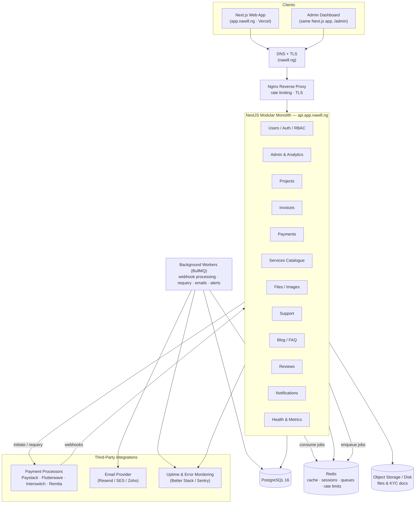
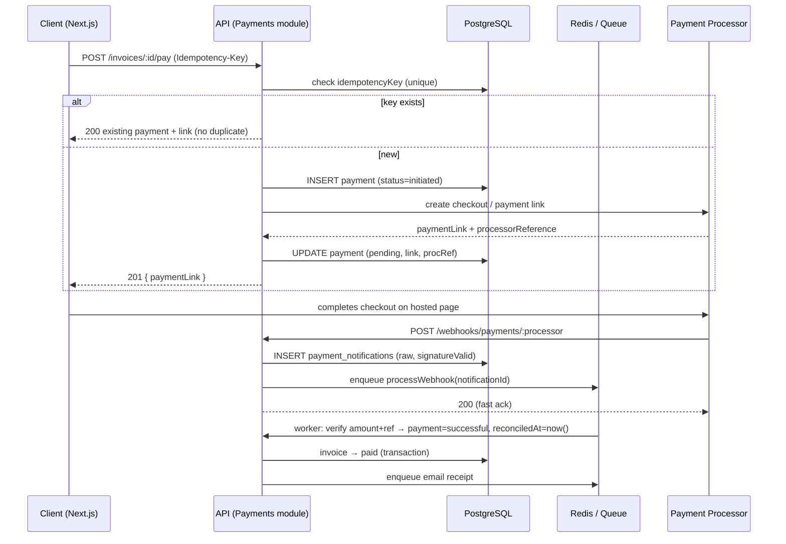
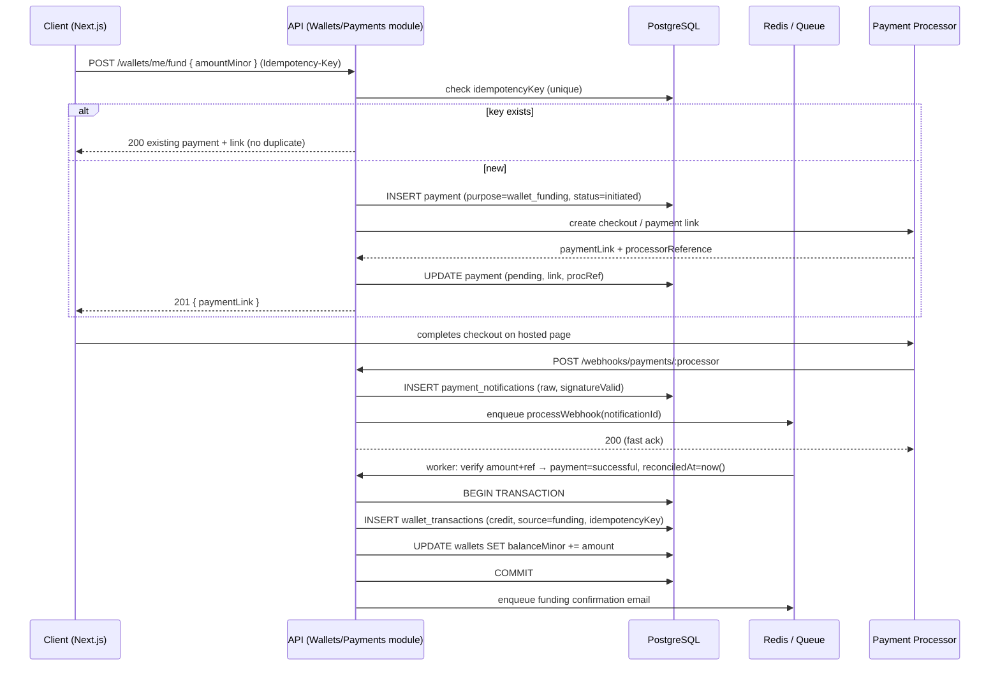
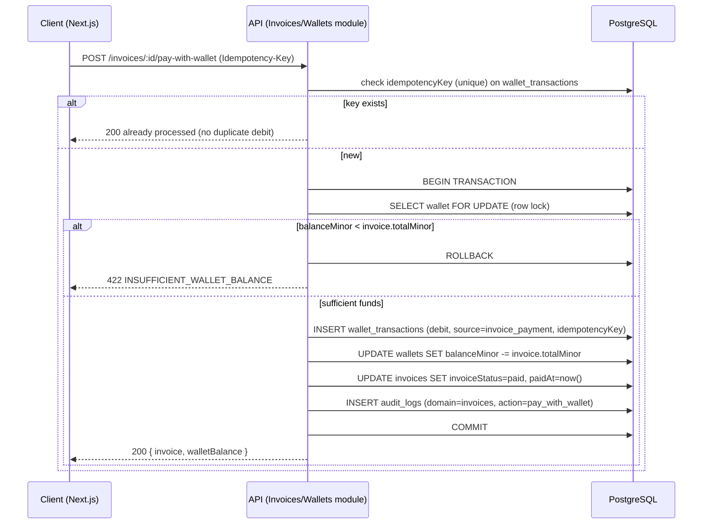
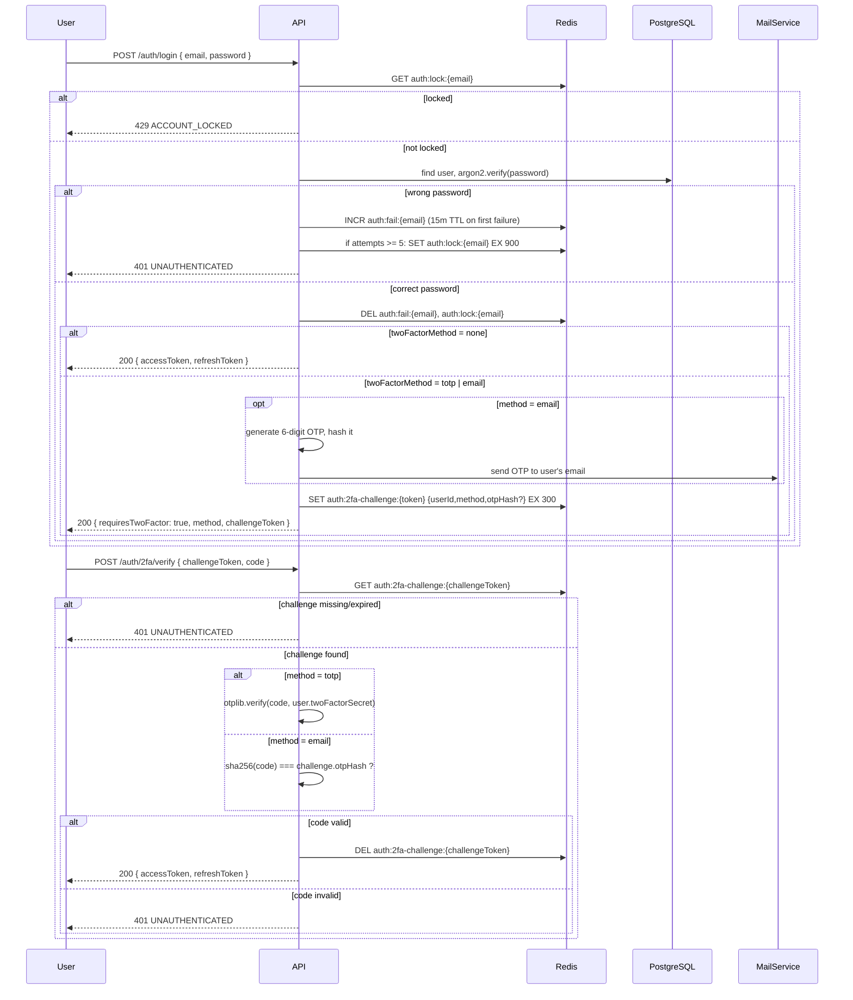
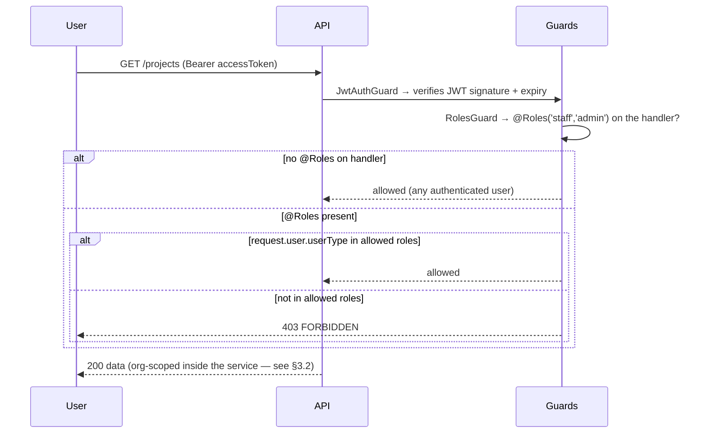

# Nawill App — Technical Docs & Flow Diagrams

**Document version:** 1.0 · **Date:** 18 July 2026
**Author:** Ushahemba Shir
**Status:** Draft for review

Companion docs: [PRD](./PRD.md) · [Architecture & Database Schema](./ARCHITECTURE.md)

---

## 1. API Design & Documentation Standards

### 1.1 URL Convention

```
{{baseUrl}}/api/v1/<resource>

Dev:  https://api.dev.app.nawill.ng/api/v1/...
Prod: https://api.app.nawill.ng/api/v1/...
```

Rules:
- Versioned under `/api/v1`; breaking changes bump to `/api/v2`.
- Resources are plural nouns, kebab-case: `/projects`, `/invoice-items`, `/support-tickets`.
- Nested only one level deep where ownership is intrinsic: `/projects/:projectId/changes`.
- Actions that aren't CRUD use a verb sub-resource: `POST /payments/:id/requery`, `POST /invoices/:id/pay`.
- Filtering, sorting, searching via query params: `?status=pending&sort=-createdAt&search=hosting`.

### 1.2 Standard Endpoint Conventions

| Method | Pattern | Meaning |
|---|---|---|
| GET | `/resources` | Paginated list |
| GET | `/resources/:id` | Single resource |
| POST | `/resources` | Create |
| PATCH | `/resources/:id` | Partial update |
| DELETE | `/resources/:id` | Soft delete (sets `deletedAt`) |

### 1.3 Standard Response Envelope

```jsonc
// Success (single resource)
{
  "success": true,
  "message": "Project retrieved successfully",
  "data": { "id": "…", "name": "…" }
}

// Success (list)
{
  "success": true,
  "message": "Projects retrieved successfully",
  "data": [ /* items */ ],
  "meta": {
    "limit": 20,
    "nextCursor": "018f2c1e-...-b3a2",
    "hasNextPage": true
  }
}

// Error
{
  "success": false,
  "message": "Validation failed",
  "errors": [
    { "field": "email", "message": "email must be a valid email" }
  ],
  "errorCode": "VALIDATION_ERROR",
  "requestId": "req_01J9X…"
}
```

HTTP status codes: `200`/`201` success, `400` validation, `401` unauthenticated, `403` forbidden (RBAC), `404` not found, `409` conflict (e.g. duplicate idempotency key), `422` unprocessable, `429` rate-limited, `500` internal.

### 1.4 Pagination

All list endpoints use **cursor pagination**, not page/limit — `GET /api/v1/invoices?cursor=<lastItemId>&limit=20`.

- `limit` (default 20, max 100). `cursor` is the `id` of the last item from the previous page — omit it for the first page.
- Rows are ordered `createdAt desc, id desc` (a stable compound order — `createdAt` alone isn't unique enough to page against reliably); the service fetches `limit + 1` rows, and if the extra row exists, `meta.nextCursor` is set to the last returned item's `id` and `meta.hasNextPage` is `true`.
- No `totalItems`/`totalPages`/page-jumping — cursor pagination doesn't support "go to page 6" by design, since counting the full set defeats the point of avoiding `OFFSET` on large tables. If a future admin screen needs page numbers, it can query a `COUNT(*)` separately rather than mixing the two schemes.
- Implementation: `apps/api/src/common/dto/pagination.dto.ts` (`CursorPaginationDto`, `cursorArgs()`, `sliceCursorPage()`), reused by every list endpoint (projects, invoices, wallet transactions, support tickets, etc.) rather than each module rolling its own.

### 1.5 Request Body Standards

- JSON only (`Content-Type: application/json`), except file uploads (`multipart/form-data`).
- camelCase keys everywhere.
- Validation with `class-validator` DTOs; unknown fields stripped (`whitelist: true`).
- Money is always integer minor units (kobo) + currency (NGN) — never floats.
- Dates in ISO-8601 UTC.

### 1.6 Auth & Headers

```
Authorization: Bearer <accessToken>       # JWT, 15 min expiry
X-Refresh-Token (or httpOnly cookie)      # refresh, 7 days, rotated
Idempotency-Key: <uuid>                   # required on POST /payments
X-Request-Id: <uuid>                      # generated if absent; echoed back
```

### 1.7 Representative Endpoint Map

```
Auth & Users
  POST   /auth/signup                 POST  /auth/verify-email      (public — {token})
  POST   /auth/login                  POST  /auth/refresh
  POST   /auth/forgot-password        POST  /auth/reset-password
  POST   /auth/change-password        (authenticated)
  POST   /auth/resend-verification    (authenticated, no-op if already verified)
  POST   /auth/2fa/verify             (public — completes a login challenge)
  POST   /auth/2fa/totp/setup         POST  /auth/2fa/totp/enable
  POST   /auth/2fa/email/request-code POST  /auth/2fa/email/enable
  POST   /auth/2fa/disable
  GET    /users/me                    PATCH /users/me
  GET    /users            (staff)    PATCH /users/:id       (admin)

Organizations & KYC
  GET    /organizations (staff/admin) → list all, for the admin org directory
  POST   /organizations               GET   /organizations/:id
  PATCH  /organizations/:id           POST  /organizations/:id/kyc-documents

Roles & Permissions (admin)
  GET    /roles                       → seeded roles (super_admin, admin, project_manager, finance, support_agent, client)
  GET    /users/:userId/roles         POST  /users/:userId/roles          {roleId}
  DELETE /users/:userId/roles/:roleId → revoke (soft delete on user_roles)
  The full (domain, action) permission-matrix tables (permissions/role_permissions) are seeded but not
  yet exposed or enforced — RolesGuard still checks only the coarse `users.userType` — see QA.md §7.

Project Inquiries (leads)
  POST   /project-inquiries           (public — website "Start a Project" form)
  GET    /project-inquiries (staff)   PATCH /project-inquiries/:id (staff)
  POST   /project-inquiries/:id/convert (staff)  → creates client + project

Projects
  GET    /projects                    POST  /projects        (staff)
  GET    /projects/:id                PATCH /projects/:id    (staff)
  DELETE /projects/:id                (staff, soft delete)
  GET    /projects/:id/milestones     POST/PATCH milestones  (staff)
  GET    /projects/:id/changes        POST  /projects/:id/changes (staff)
  POST   /projects/:id/status-requests        (client)

Services (catalogue)
  GET    /services                    POST/PATCH /services   (admin)

Invoices
  GET    /invoices                    POST  /invoices        (staff) — items[] (1+), discountMinor?, vatEnabled?, vatRate?
  GET    /invoices/:id                PATCH /invoices/:id    (staff — dueDate, invoiceStatus, notes)
  POST   /invoices/:id/pay            → returns payment link
  Invoice items support an optional `period` (freeform, e.g. "1 Year") and `isCancelled` (waives the
  line — actualAmountMinor becomes 0, unitAmountMinor kept for the struck-through PDF display). Reads
  include a minimal `organization: {name, headOffice}` for the invoice PDF's bill-to block (see
  Architecture doc §8.6). Discount/VAT: `subtotalMinor` = sum of non-cancelled item amounts;
  `discountMinor` (flat, optional, must not exceed subtotalMinor — 400 if it does) is subtracted first;
  `vatEnabled` + `vatRate` (percentage, e.g. 7.5, required when vatEnabled) compute `taxMinor` on the
  discounted amount; `totalMinor` = (subtotalMinor − discountMinor) + taxMinor.

Payments
  POST   /payments/initiate           GET   /payments/:id
  POST   /payments/:id/requery (staff)
  POST   /webhooks/payments/:processor        (public, signature-verified)
  GET    /payment-processors (admin)  POST  /payment-processors (admin)

Wallets
  GET    /wallets/me                  GET   /wallets/me/transactions
  POST   /wallets/me/fund             → creates payment (purpose=wallet_funding), returns paymentLink
  POST   /invoices/:id/pay-with-wallet        (client) → synchronous debit + invoice paid
  GET    /wallets/:userId (staff)     POST  /wallets/:userId/adjustments (staff, reason required)

Bank Accounts
  GET    /bank-accounts/banks         → bank name/code list (Paystack, or the mock fallback — see ARCHITECTURE.md §7.8)
  POST   /bank-accounts               → resolves accountName via Paystack, verifies + creates
  GET    /bank-accounts/me
  PATCH  /bank-accounts/:id/set-default
  DELETE /bank-accounts/:id           (soft delete)

Countries & Administrative Divisions (all public — no auth required for pickers)
  GET    /countries                   GET   /countries/:id
  POST   /countries (admin)
  GET    /countries/:id/divisions?tier=1              → top-level divisions (e.g. states)
  GET    /countries/:id/divisions?parentId=<stateId>  → children of a division (e.g. LGAs)
  POST   /countries/:id/divisions (admin)
  GET    /divisions/:id               GET   /divisions/:id/children

Analytics
  GET    /analytics/me/overview       (client) → projects, wallet, invoices, tickets summary

Referrals (Phase 3 — schema migrated, NOT implemented in this build; see PRD §4.3)
  POST   /referrals/me/code           GET   /referrals/me
  POST   /referrals/:id/commissions/:commissionId/approve (staff)

Files
  POST   /files (multipart)           GET   /files/:id       DELETE /files/:id

Support
  GET    /support-tickets             POST  /support-tickets  (creates the ticket + its opening message in one call — `message` is required on CreateTicketDto)
  GET    /support-tickets/:id         PATCH /support-tickets/:id  (staff — assignedTo, ticketStatus, priority)
  POST   /support-tickets/:id/close   (ticket owner or staff/admin) → self-service close, sets ticketStatus=closed + resolvedAt
  POST   /support-tickets/:id/messages  (for replies after the ticket exists)

Knowledge Base (read-only from the client; no admin authoring UI yet — see QA.md §7)
  GET    /knowledge-base/categories               → list, each with an articleCount
  GET    /knowledge-base/categories/:slug         → category + its articles
  GET    /knowledge-base/articles/:slug           → single article
  GET    /ticket-types

Blog / FAQ (admin write, public read)
  GET    /blog-posts                  GET   /blog-posts/:slug
  POST   /blog-posts (admin)          PATCH /blog-posts/:id (admin)

Reviews
  POST   /reviews                     GET   /reviews

Admin Analytics
  GET    /admin/analytics/overview
  GET    /admin/analytics/users | /projects | /invoices | /payments
  GET    /admin/audit-logs

Ops
  GET    /health          GET /health/ready       GET /metrics (protected)
```

Swagger/OpenAPI is live at `/api/docs` (open in dev/test, Basic-Auth gated in prod — `SWAGGER_USER`/`SWAGGER_PASSWORD`). It's generated automatically: the `@nestjs/swagger` CLI plugin (`apps/api/nest-cli.json`) reads every DTO's TypeScript types and `class-validator` decorators at build time, so request schemas show up in Swagger without hand-written `@ApiProperty` on every field — controllers only add `@ApiTags(...)` (and `@ApiBearerAuth('bearer')` where JWT-protected) to group routes and mark auth requirements. A Postman collection exported from the live OpenAPI JSON (`GET /api/docs-json`) can be versioned in the repo (`/docs/postman`) once the API stabilizes further — not generated yet in this build.

---

## 2. Flow Diagrams

### 2.1 System Architecture



### 2.2 Request Flow — Client Pays an Invoice



### 2.3 Fund Wallet

Reuses the same payment machinery as invoice payment (§2.2) — only the `purpose` and the reconciliation side effect differ.



### 2.4 Pay Invoice with Wallet

No processor, no webhook — a single synchronous DB transaction. This is the fast path clients are steered toward once they have a funded wallet.



### 2.5 Login — Lockout & Optional 2FA



### 2.6 RBAC Guard (per request)



> This is the coarse `userType`-based guard actually enforced in this build, not the fine-grained `(domain, action)` permission-matrix guard described in §3.2 — see [QA.md §7](./QA.md#7-known-gaps-explicitly-out-of-scope-for-this-pass).

---

## 3. Deep Dives

### 3.1 Payments & Wallet: Idempotency, Webhooks, Reconciliation, Requery

This is the highest-risk area of the system; it gets the most defensive design and the heaviest test coverage (see [QA.md](./QA.md)). It covers two flows that share machinery: paying an invoice via a processor link (§2.2), and funding a wallet (§2.3) — both are `payments` rows distinguished by `purpose`. A third flow, paying an invoice *from* wallet balance (§2.4), deliberately bypasses all of this because it never leaves our own database.

- **Idempotency everywhere money moves.** Every `POST /payments/initiate` (and `/wallets/me/fund`, which is the same code path) requires an `Idempotency-Key` header, stored as a unique column; a retry (network timeout, double-click) returns the original payment instead of creating a duplicate. `POST /invoices/:id/pay-with-wallet` requires the same header, enforced as a unique column on `wallet_transactions.idempotencyKey` — a retried request returns the already-applied result instead of debiting twice. Keys expire logically after 24 h.
- **Webhook inbox pattern.** Webhooks are written raw to `payment_notifications` and acknowledged within milliseconds — processing happens asynchronously in a BullMQ worker. This guarantees we never lose an event because our business logic was slow or briefly broken, and gives a full replayable audit trail.
- **Signature verification.** Each processor adapter verifies its signature scheme (Paystack `x-paystack-signature` HMAC-SHA512, Flutterwave `verif-hash`, the mock adapter's own HMAC in dev/test, etc.) before the event is trusted; invalid signatures are stored with `signatureValid=false` and ignored.
- **Verification before trust.** A webhook alone never marks a payment successful. The worker re-verifies with the processor's verify endpoint (amount, currency, reference) and only then, in a single DB transaction, applies the purpose-specific side effect: `purpose=invoice_payment` → `payment → successful`, `reconciledAt = now()`, `invoice → paid`; `purpose=wallet_funding` → `payment → successful`, `reconciledAt = now()`, insert `wallet_transactions` credit row, `wallets.balanceMinor += amount`. Either way, an audit log entry and a receipt/confirmation email are enqueued.
- **Wallet debit is a transaction, not an event.** `pay-with-wallet` locks the wallet row (`SELECT ... FOR UPDATE`), checks sufficient balance, and writes the debit + invoice-paid update atomically — there is no async step and therefore no reconciliation window to exploit. This is the main reason the wallet path is the "instant" payment option.
- **Requery job.** A scheduled job (every 15 min) finds `payments` stuck in `pending` beyond 10 minutes (either purpose) and requeries the processor — this catches missed webhooks. Staff can also trigger `POST /payments/:id/requery` manually. Payments still unresolved after 24 h are flagged `abandoned` and surfaced on the admin dashboard. *(Deferred to Phase 2 — the MVP mock processor resolves synchronously in tests, so there's nothing to requery yet; the job and its cron wiring are not in this build.)*
- **Processor abstraction.** A `PaymentProcessorAdapter` interface (`createLink`, `verify`, `parseWebhook`) with one implementation per processor, selected via the `payment_processors` table — new processors are onboarded without touching core payment or wallet logic. This build ships a `mock` adapter (deterministic, no network calls) so the full initiate → webhook → reconcile loop is exercised in tests without live keys.

### 3.2 RBAC Design (supports §2.6)

Target design: permissions are `(domain, action)` pairs — e.g. `(invoices, write)` — bundled into roles (`super_admin`, `admin`, `project_manager`, `finance`, `support_agent`, `client`), assigned to users via `user_roles`, enforced by a `@RequirePermission('invoices','write')` decorator with the effective permission set cached in Redis.

**What's actually live in this build:** the `roles`/`permissions`/`role_permissions`/`user_roles` tables exist and are seeded, but enforcement is the coarser `@Roles('staff','admin')` guard on `users.userType` shown in §2.6 — no per-permission checks, no Redis permission cache. Row-level scoping (clients restricted to rows where `organizationId` matches theirs) *is* live, enforced in each module's service method, not just at the guard layer — see `assertAccess()` in `invoices.service.ts`, `projects.service.ts`, etc.

### 3.3 Structured Logging, Health & Monitoring

- **Logging:** Pino (via `nestjs-pino`) — JSON logs with `requestId`, `userId`, `module`, `latency`, and `status` on every request; error logs carry stack + context. Ship to file + optional Better Stack/Loki. Never log passwords, tokens, or full card/webhook secrets.
- **Health:** `@nestjs/terminus` at `GET /health` → checks Postgres (`SELECT 1`), Redis (`PING`), disk, and memory. `GET /health/ready` gates deployments. When a dependency is down the endpoint returns 503 with per-component detail:

```json
{ "status": "error", "details": { "database": {"status":"up"}, "redis": {"status":"down"} } }
```

- **Alerting:** uptime monitor pings `/health` every 30 s; on failure it alerts email/Slack ("Redis is down on prod"). Sentry captures unhandled exceptions with release tagging.
- **Metrics:** `/metrics` (Prometheus format, IP-restricted) — request rate, p95 latency, error rate, queue depth.

### 3.4 Consistency Model

- **Strong within transactions:** payment reconciliation + invoice update happen atomically; invoice totals recomputed from items in the same transaction.
- **Eventual elsewhere:** analytics counters, notification sending, cache-backed reads (60 s TTL on dashboards), and audit fan-out tolerate seconds of lag — matching the stated eventual-consistency NFR without risking money correctness.

### 3.5 File / Image Management

- Uploads via `multipart/form-data` → validated (MIME allowlist, ≤ 5 MB avatars / ≤ 10 MB docs) → stored on object storage (S3-compatible; local disk adapter for dev) under `purpose/orgId/uuid.ext`.
- DB stores metadata only (`files` table); downloads served via short-lived signed URLs — KYC docs are never publicly reachable.
- Avatars resized server-side (`sharp`) to 256×256 WebP.

---

## 4. Environment Setup (Dev & Prod)

| | Dev | Prod |
|---|---|---|
| API | `https://api.dev.app.nawill.ng` | `https://api.app.nawill.ng` |
| UI | `https://dev.app.nawill.ng` | `https://app.nawill.ng` |
| Hosting (API) | SoftKloud | SoftKloud |
| Hosting (UI) | Vercel (preview branch) | Vercel (production) |
| Database | Postgres `nawill_dev` | Postgres `nawill_prod` (separate instance/user, daily backups) |
| Redis | DB 0 (dev) | Dedicated instance/DB with auth |
| Payment processors | Sandbox/test keys | Live keys (encrypted) |
| Email | Sandbox (Mailtrap/Resend test) | Live domain-verified sender |
| Logging | Pretty logs, debug level | JSON, info level, shipped + retained 30 d |
| Swagger | Open | Basic-auth protected |
| Deploy trigger | Merge to `develop` | Release tag `v*` (manual approval) |

Both environments are configured only via environment variables (12-factor); `.env.example` versioned, real secrets in SoftKloud secret store / GitHub environments. DNS: A records for the two API subdomains → SoftKloud IP (Nginx terminates TLS via Let's Encrypt); CNAME for the two UI domains → Vercel.

**This build's actual dev setup** doesn't match the table above yet — there's no deployed dev/prod environment. What exists: local Postgres + Redis (installed directly, per the QA.md decision log — not via Docker) for running the app and its test suite, plus a Docker image and Compose stack (below) for whenever an actual deployment target is picked.

---

## 5. Testing

Test strategy, disposable-database setup, and coverage of sensitive flows (wallet ledger, payment idempotency/reconciliation, auth/RBAC, account security) are documented separately in **[QA.md](./QA.md)**.

---

## 6. Deployment (Docker)

Both apps build from the **monorepo root** as context (a pnpm workspace hoists `node_modules` at the root, so neither Dockerfile can build from its own `apps/*` directory alone):

- `apps/api/Dockerfile` — three-stage (`deps` → `build` → `runtime`). Container `CMD` runs `prisma migrate deploy && prisma db seed && node dist/src/main.js` on every start — migrations and the idempotent seed (Architecture doc §4) both being safe to re-run means there's no separate "first boot" logic to get wrong. Listens on **3000** inside the network.
- `apps/web/Dockerfile` — Next.js [standalone output](https://nextjs.org/docs/pages/api-reference/next-config-js/output) (`output: 'standalone'` in `next.config.mjs`), so the runtime image only ships the `node_modules` subset actually used rather than the full workspace tree. Listens on **3000** inside the network too — `docker-compose.yml` maps it to host port **8000** since the `api` service already claims host `3000`.

```bash
docker compose build          # from the repo root — builds both images
docker compose up             # postgres + redis + api + web
```

`docker-compose.yml` gets each app's non-network config via `env_file: [apps/api/.env]` / `env_file: [apps/web/.env.local]` — the **same** `.env` files used for `make dev-api`/`make dev-web` locally, and the same files `deploy-dev.yml`/`deploy-prod.yml` write from GitHub Secrets on a real host (§8). `DATABASE_URL`, `REDIS_URL`, and `NAWILL_API_URL` are then overridden in the `environment:` block regardless of what's in those files, since inside the Compose network the right hostnames are the service names (`postgres`, `redis`, `api`), not `localhost`.

This Compose stack is **not** used by the test suite — `pnpm test:e2e` talks to a directly-installed local Postgres/Redis (see [QA.md §3](./QA.md#3-disposable-database--test-and-erase)), which is faster to iterate against than a container. The two setups (bare-metal for dev/test, Docker for deploy) are intentionally different tools for different jobs, not an inconsistency.

**Not build-tested** — the Docker daemon wasn't running on the machine this was built on (see [QA.md §7](./QA.md#7-known-gaps-explicitly-out-of-scope-for-this-pass)). `pnpm build` for both apps (the same build Docker runs) was verified directly, including the standalone-output step for web, so the Dockerfiles are exercising a known-working build — but `docker compose build && docker compose up` itself hasn't been run.

---

## 7. Common Commands

A root `Makefile` wraps the `pnpm --filter` commands so day-to-day work doesn't require remembering which workspace package owns which script:

| Command | Does |
|---|---|
| `make install` | `pnpm install` for the whole workspace |
| `make dev-api` | API in watch mode — needs local Postgres + Redis (§4) |
| `make dev-web` | Web app dev server — needs the API running (`NAWILL_API_URL` in `apps/web/.env.local`, see `apps/web/.env.local.example`) |
| `make build` | Builds both API and web |
| `make test` / `make test-e2e` | API unit / e2e tests (see [QA.md](./QA.md)) |
| `make migrate` | `prisma migrate dev` (interactive, creates a new migration) |
| `make migrate-deploy` | `prisma migrate deploy` (non-interactive, applies pending migrations) |
| `make seed` | Runs the idempotent seed script |
| `make studio` | Opens Prisma Studio against the dev database |
| `make docker-build` / `make docker-up` / `make docker-down` | Build/run/stop the Docker Compose stack (§6) |
| `make clean` | Removes `node_modules`, `dist`, `.next`, `coverage` across the workspace |

Run `make` (or `make help`) with no target for the same list with descriptions inline. This is a convenience layer, not a replacement for `pnpm` — every target is a one-line wrapper, nothing Makefile-specific to debug if a command misbehaves.

**Local ports, so `dev-api` and `dev-web` can run side by side:** the API listens on **4000** (`apps/api/.env` → `PORT=4000`), leaving Next.js's default **3000** free for the web app. `apps/web/.env.local` points `NAWILL_API_URL` at `http://localhost:4000/api/v1` accordingly — both are already set this way in this repo's `.env`/`.env.example` files, not something you need to reconcile by hand.

---

## 8. Branching Model & CI/CD

### 8.1 Branches

Two long-lived branches:

- **`main`** — production. Only ever moves via a merged pull request. Direct pushes are blocked by branch protection (§8.4) — this is the *only* branch with protection rules configured; `dev` has none, by convention rather than enforcement (see below).
- **`dev`** — the integration/base branch. Everything lands here first. Not intended for direct commits either — the convention is the same discipline as `main`, just not machine-enforced — but pushing straight to `dev` won't be rejected the way pushing straight to `main` is.

Day-to-day work:

1. Branch off `dev`: `feat/<short-description>` for new work, `fix/<short-description>` for a bug fix.
2. Open a PR into `dev`. CI (`ci.yml`, §8.2) has to pass. Merge.
3. Merging into `dev` triggers `deploy-dev.yml` (§8.3) — the dev environment always reflects the tip of `dev`.
4. When `dev` is ready to ship, open a PR from `dev` into `main`. Merge triggers `deploy-prod.yml`.

**Hotfixes** (an urgent bug in production that can't wait for the next `dev` → `main` cycle): branch off `main` as `hotfix/<short-description>`, PR into `main` directly, merge (deploys immediately). Then **also** merge (or cherry-pick) that same fix into `dev`, so `dev` doesn't regress and ship the bug again on the next normal release. This is the one path that touches `main` without going through `dev` first — everything else follows the linear `feat|fix → dev → main` flow above.

### 8.2 CI (`ci.yml`)

Runs on every push and PR targeting `dev` or `main` — two independent jobs:

- **`api`** — typecheck, unit tests, e2e tests (against `postgres:16-alpine` + `redis:7-alpine` service containers configured with `POSTGRES_USER: runner` + `POSTGRES_HOST_AUTH_METHOD: trust`, replicating this project's local trust-auth setup exactly so `test/setup/global-setup.ts` needs zero CI-specific branching — see [QA.md §3](./QA.md#3-disposable-database--test-and-erase)), then a production build.
- **`web`** — production build only (no frontend test suite yet, per [QA.md §7](./QA.md#7-known-gaps-explicitly-out-of-scope-for-this-pass)).

A PR can't merge into either protected path without this passing (branch protection requires it as a status check on `main`; treat it as required for `dev` too even though it isn't machine-enforced there).

### 8.3 Deploy Workflows

`deploy-dev.yml` (triggers on push to `dev`) and `deploy-prod.yml` (triggers on push to `main`) are both thin wrappers around one reusable workflow, `_deploy.yml` — the actual deploy mechanics exist in exactly one place. Each SSHs into a host and:

1. `git fetch` + `git reset --hard` to the deployed branch.
2. Writes two GitHub Secrets — the **entire contents** of an env file, not enumerated key-by-key — to `apps/api/.env` and `apps/web/.env.local` on the host.
3. `docker compose build && docker compose up -d` (§6), then prunes dangling images.

**Required secrets**, per environment (`DEV_*` and `PROD_*`, mirrored):

| Secret | Contents |
|---|---|
| `{DEV,PROD}_SSH_HOST` | Hostname/IP of the deploy target |
| `{DEV,PROD}_SSH_USER` | SSH user |
| `{DEV,PROD}_SSH_KEY` | Private key for that user (deploy key, not a personal key) |
| `{DEV,PROD}_APP_PATH` | Absolute path to this repo's checkout on the host |
| `{DEV,PROD}_API_ENV_FILE` | Full contents of `apps/api/.env` for that environment — every key in `apps/api/.env.example`, with real values |
| `{DEV,PROD}_WEB_ENV_FILE` | Full contents of `apps/web/.env.local` for that environment — just `NAWILL_API_URL` (§7 local-ports note doesn't apply on a real host; point it at wherever that host's API is actually reachable) |

This is the "env values picked from git secrets, pasted into `.env` on the service's host" pattern as directly as GitHub Actions supports it — one secret per file, written verbatim, rather than reconstructing the file from a dozen individual secrets.

Set these up under **Settings → Environments** (`dev` and `prod`) rather than repository-wide secrets, so a `prod` secret is never readable by a workflow run triggered from `dev`. A `prod` environment can additionally require manual approval before deploying — configure that in the environment's settings if/when it matters; nothing in `_deploy.yml` assumes either way.

### 8.4 Branch Protection on `main`

Configure once, in **Settings → Branches → Add rule** for `main`:
- Require a pull request before merging (no direct pushes, including from admins, if you want it airtight).
- Require the `ci.yml` status checks to pass before merging.
- Require the branch to be up to date before merging.

`dev` intentionally has no equivalent rule — see §8.1 for why that's a convention, not a gap.

---

*End of Technical Docs — Nawill App v1.0.*
